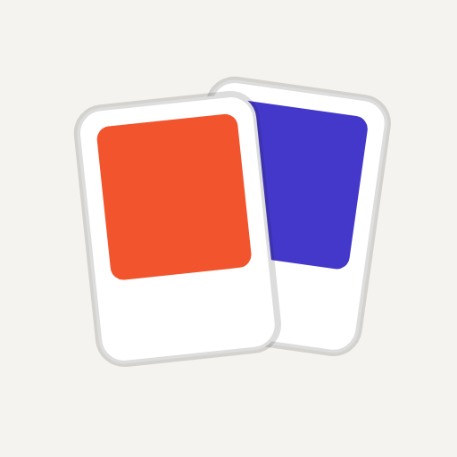

  

<h1 align="center">Color Memory</h1>

  See a color, memorize it, rebuild it from memory — scored the way the eye sees color. 
  <a href="https://color-memory-blush.vercel.app">Play it</a> in English or Spanish.

## About

Color Memory shows a color as a paint chip for a few seconds, then hides it and asks you to rebuild it with
a hue, saturation and brightness picker. Your guess is scored against the target by perceptual (OKLab)
distance rather than raw HSL numbers, so a "close" answer is one that actually _looks_ close.

Every color is generated, timed and scored on the server, so scores can be compared fairly on the
leaderboards. You can play without an account; signing in keeps your games, stats and collection on any
device.

## Features

- **Five modes**, each stressing a different part of visual memory:

  | Mode      | Rounds    | What changes                                                 |
  | --------- | --------- | ------------------------------------------------------------ |
  | Daily     | 5         | The same colors for everyone, once a day                     |
  | Classic   | 8         | 3 seconds to memorize each color                             |
  | Speed     | 8         | Memorize time shrinks every round, down to 0.5 s             |
  | Precision | 8         | Each target drifts closer to the last, so they're harder to tell apart |
  | Endless   | Unlimited | Time shrinks to 1 s; three misses end the game               |

- **Perceptual scoring** with per-channel feedback: see how far off your hue, saturation and lightness were.
- **A paint-chip look** — modes are a painter's sample deck, and each color gets an invented name
  ("Cobalt of the Circus"), the same for every player. Colors are shown and compared on a neutral gray
  surround, identical in light and dark mode.
- **Leaderboards** — one per day for the daily challenge and a weekly one for every other mode, opt-in.
- **Stats** — averages, score distribution, streaks and your clearest tendency (picking colors too light,
  too dark, too saturated…).
- **Your sample deck** — every color you nail with 90 or more is collected in your profile.
- **Share the daily** as text or an image that shows your scores without spoiling the colors.
- **Optional accounts** with Discord, an email code or a password; anonymous games move to your account
  when you sign in.
- **English and Spanish**, with translated URLs.
- **Installable** as an app, with an offline page.
- **Accessible** — full keyboard control of the color picker and the mode deck, a reduce-motion setting,
  and optional sounds that are off by default.
